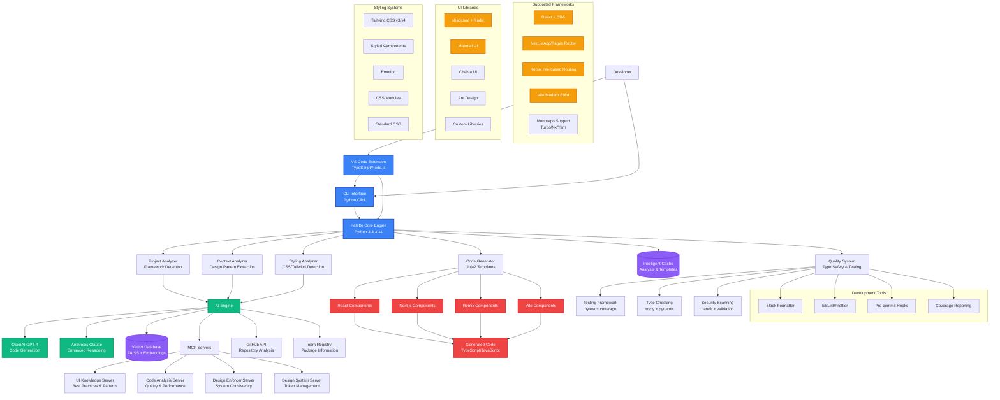
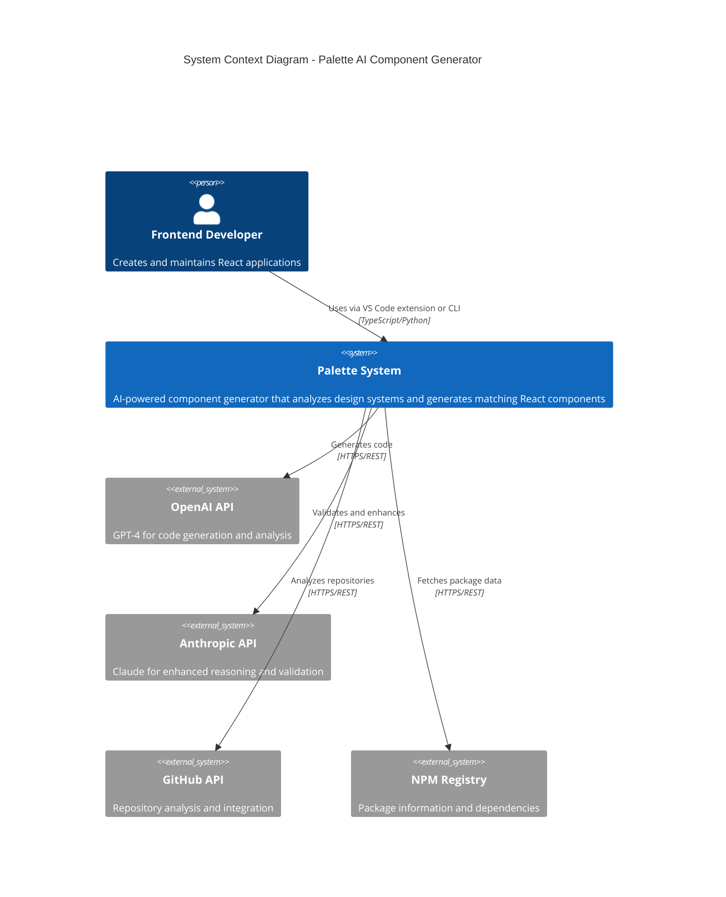
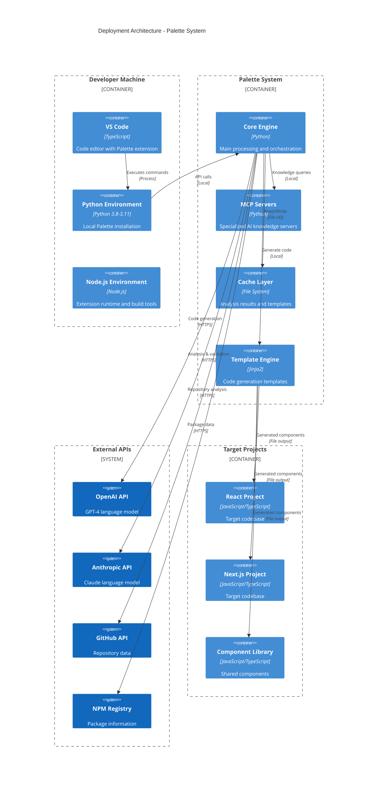

# Palette Tech Stack Documentation

## Project Overview

**Palette** is an AI-powered component generator for design systems that analyzes project patterns and generates React components matching existing design systems. It's built as a comprehensive Python application with VS Code extension integration and Model Context Protocol (MCP) server capabilities.

## Architecture Diagram



---

## System Overview



---

## Data Flow Diagram

```mermaid
flowchart LR
    %% Input Layer
    ProjectFiles[Project Files<br/>package.json, configs] --> Analyzer{Project Analyzer}
    UserPrompt[User Prompt<br/>Component Requirements] --> Analyzer

    %% Analysis Phase
    Analyzer --> PatternExtraction[Pattern Extraction<br/>Colors, Typography, Spacing]
    Analyzer --> FrameworkDetection[Framework Detection<br/>Next.js, React, Vite]
    Analyzer --> DependencyAnalysis[Dependency Analysis<br/>UI Libraries, Styling]

    %% Intelligence Layer
    PatternExtraction --> ContextBuilder[Context Builder<br/>Design System Profile]
    FrameworkDetection --> ContextBuilder
    DependencyAnalysis --> ContextBuilder

    ContextBuilder --> AIPrompt[AI Prompt Engineering<br/>Structured Context]

    %% AI Processing
    AIPrompt --> AIProvider{AI Provider Selection}
    AIProvider -->|Primary| OpenAIGPT[OpenAI GPT-4<br/>Code Generation]
    AIProvider -->|Fallback| AnthropicClaude[Anthropic Claude<br/>Enhanced Analysis]

    %% MCP Enhancement
    OpenAIGPT --> MCPValidation[MCP Server Validation<br/>Quality & Best Practices]
    AnthropicClaude --> MCPValidation
    MCPValidation --> UIKnowledgeValidation[UI Knowledge Validation]
    MCPValidation --> CodeQualityCheck[Code Quality Analysis]

    %% Generation Phase
    MCPValidation --> CodeGeneration[Code Generation<br/>Jinja2 Templates]
    CodeGeneration --> ComponentCode[React Component<br/>TypeScript/JavaScript]

    %% Output Processing
    ComponentCode --> QualityGate{Quality Gate}
    QualityGate -->|Pass| OutputFormatting[Output Formatting<br/>Prettier, ESLint]
    QualityGate -->|Fail| ErrorFeedback[Error Feedback<br/>Suggestions & Fixes]

    OutputFormatting --> FinalOutput[Final Component<br/>Ready for Integration]
    ErrorFeedback --> ContextBuilder

    %% Caching Layer
    PatternExtraction -.-> Cache[(Intelligent Cache<br/>Analysis Results)]
    ContextBuilder -.-> Cache
    MCPValidation -.-> Cache

    %% Styling
    classDef input fill:#ddd6fe,stroke:#8b5cf6,stroke-width:2px
    classDef process fill:#bfdbfe,stroke:#3b82f6,stroke-width:2px
    classDef ai fill:#bbf7d0,stroke:#10b981,stroke-width:2px
    classDef output fill:#fed7d7,stroke:#ef4444,stroke-width:2px
    classDef storage fill:#fef3c7,stroke:#f59e0b,stroke-width:2px

    class ProjectFiles,UserPrompt input
    class Analyzer,PatternExtraction,FrameworkDetection,DependencyAnalysis,ContextBuilder,CodeGeneration,QualityGate,OutputFormatting process
    class AIProvider,OpenAIGPT,AnthropicClaude,MCPValidation ai
    class ComponentCode,FinalOutput,ErrorFeedback output
    class Cache storage
```



## Core Technologies

### Backend (Python)

**Version Requirements:** Python 3.8-3.11  
**Package Management:** pip with setuptools

#### Core Dependencies

| Package         | Version | Purpose                                 |
| --------------- | ------- | --------------------------------------- |
| `click`         | ≥8.1.0  | CLI interface framework                 |
| `openai`        | ≥1.0.0  | OpenAI API integration                  |
| `anthropic`     | ≥0.18.0 | Claude/Anthropic API integration        |
| `jinja2`        | ≥3.1.0  | Template engine for code generation     |
| `pydantic`      | ≥2.0.0  | Data validation and settings management |
| `python-dotenv` | ≥1.0.0  | Environment variable management         |

#### AI/ML Libraries

| Package                 | Version | Purpose                                  |
| ----------------------- | ------- | ---------------------------------------- |
| `sentence-transformers` | ≥2.2.0  | Semantic embeddings for pattern matching |
| `faiss-cpu`             | ≥1.7.0  | Vector similarity search                 |
| `numpy`                 | ≥1.21.0 | Numerical computations                   |

#### Utility Libraries

| Package          | Version | Purpose                               |
| ---------------- | ------- | ------------------------------------- |
| `requests`       | ≥2.28.0 | HTTP client                           |
| `aiohttp`        | ≥3.8.0  | Async HTTP client                     |
| `rich`           | ≥13.0.0 | Terminal formatting and progress bars |
| `pathlib2`       | ≥2.3.0  | Enhanced path handling                |
| `asyncio-extras` | ≥1.3.0  | Async utilities                       |

---

## Development Tools

### Code Quality & Testing

| Tool         | Version | Purpose                       |
| ------------ | ------- | ----------------------------- |
| `black`      | ≥23.0.0 | Code formatter                |
| `isort`      | ≥5.12.0 | Import sorting                |
| `mypy`       | ≥1.5.0  | Static type checking          |
| `flake8`     | ≥6.0.0  | PEP 8 style guide enforcement |
| `pylint`     | ≥2.17.0 | Comprehensive code analysis   |
| `pytest`     | ≥7.4.0  | Testing framework             |
| `pytest-cov` | ≥4.1.0  | Coverage reporting            |
| `bandit`     | ≥1.7.5  | Security linting              |
| `pre-commit` | ≥3.3.0  | Git hooks for code quality    |

### Configuration

- **Black**: Line length 88, Python 3.8-3.11 compatibility
- **isort**: Black profile compatibility
- **mypy**: Strict type checking with external library overrides
- **Target Python versions**: 3.8, 3.9, 3.10, 3.11

---

## Frontend Integration

### VS Code Extension

**Technology Stack:**

- **Language**: TypeScript
- **Runtime**: Node.js
- **Framework**: VS Code Extension API
- **Minimum VS Code Version**: 1.60.0

**Key Features:**

- Webview-based UI
- Command palette integration
- Project analysis capabilities
- Real-time component generation

**Commands:**

- `palette.openWebview` - Open main interface
- `palette.generate` - Generate components
- `palette.analyze` - Analyze project structure
- `palette.generateInFolder` - Context-aware generation

---

## Supported Frontend Frameworks

Palette analyzes and generates code for multiple frontend frameworks:

### React Ecosystem

- **React** (standard Create React App)
- **Next.js** (App Router and Pages Router)
- **Remix** (File-based routing)
- **Vite** (Modern build tool)

### Project Structures

- **Monorepo** (Turbo, Nx, Yarn workspaces)
- **Full-stack** (Frontend/Backend separation)
- **Component Libraries** (Standalone UI packages)

### Supported UI Libraries

- **shadcn/ui** (Radix UI + class-variance-authority)
- **Material-UI** (@mui/material)
- **Chakra UI** (@chakra-ui/react)
- **Ant Design** (antd)
- **Custom component libraries**

### Styling Systems

- **Tailwind CSS** (v3/v4 with @theme blocks)
- **CSS Modules**
- **Styled Components**
- **Emotion**
- **Standard CSS**

---

## Model Context Protocol (MCP) Servers

Palette includes specialized MCP servers for enhanced AI capabilities:

### 1. UI Knowledge Server

**Purpose**: Comprehensive UI/UX knowledge and best practices

**Capabilities:**

- Component patterns from popular UI libraries
- Design principles and accessibility guidelines
- CSS best practices and Tailwind utilities
- Framework-specific patterns (React hooks, Next.js)
- Performance optimization strategies
- Animation patterns and accessibility compliance

### 2. Code Analysis Server

**Purpose**: Deep code quality analysis and improvements

**Capabilities:**

- Component architecture analysis
- Refactoring suggestions
- Accessibility validation (WCAG compliance)
- Performance bottleneck detection
- Design pattern recognition
- Anti-pattern identification

### 3. Design Enforcer Server

**Purpose**: Design system consistency enforcement

**Capabilities:**

- Design token validation
- Style guide compliance
- Component API consistency
- Brand guideline enforcement

### 4. Design System Server

**Purpose**: Design system management and evolution

**Capabilities:**

- Design token management
- Component documentation generation
- Style guide maintenance
- Version control for design assets

---

## Architecture Patterns

### Core Modules

```
src/palette/
├── analysis/          # Project structure analysis
├── generation/        # Code generation engine
├── intelligence/      # AI/ML components
├── patterns/          # Design pattern library
├── quality/           # Code quality validation
├── cache/             # Caching system
├── cli/               # Command-line interface
├── config/            # Configuration management
├── di/                # Dependency injection
├── errors/            # Error handling
├── interfaces/        # Type definitions
├── knowledge/         # Knowledge base
├── mcp/               # Model Context Protocol
├── openai_integration/ # OpenAI API client
├── preview/           # Component preview
├── studio/            # Interactive development
└── utils/             # Utility functions
```

### Module Relationships

```mermaid
graph TD
    %% Entry Points
    CLI[cli/] --> Core[Core Engine]
    VSCodeExt[VS Code Extension] --> Core

    %% Core Processing Layer
    Core --> Analysis[analysis/]
    Core --> Generation[generation/]
    Core --> Intelligence[intelligence/]

    %% Analysis Layer
    Analysis --> FrameworkDetector[Framework Detector]
    Analysis --> ContextAnalyzer[Context Analyzer]
    Analysis --> ModularAnalyzer[Modular Analyzer]

    %% Intelligence Layer
    Intelligence --> PackageAnalyzer[Package Analyzer]
    Intelligence --> StylingAnalyzer[Styling Analyzer]
    Intelligence --> UILibraryValidator[UI Library Validator]

    %% Generation Layer
    Generation --> Generator[Component Generator]
    Generation --> TemplateEngine[Template Engine]
    Generation --> ArchitectureAnalyzer[Architecture Analyzer]

    %% Supporting Systems
    Analysis --> Cache[cache/]
    Intelligence --> Cache
    Generation --> Cache

    Generation --> Quality[quality/]
    Quality --> Testing[Testing Framework]
    Quality --> TypeChecking[Type Validation]
    Quality --> Security[Security Scanning]

    %% External Integrations
    Intelligence --> OpenAI[openai_integration/]
    Intelligence --> MCP[mcp/]

    MCP --> MCPUIKnowledge[UI Knowledge Server]
    MCP --> MCPCodeAnalysis[Code Analysis Server]
    MCP --> MCPDesignEnforcer[Design Enforcer Server]
    MCP --> MCPDesignSystem[Design System Server]

    %% Configuration & Utilities
    Core --> Config[config/]
    Core --> DI[di/]
    Core --> Interfaces[interfaces/]
    Core --> Utils[utils/]

    %% Error Handling
    Analysis --> Errors[errors/]
    Generation --> Errors
    Intelligence --> Errors

    %% Knowledge Base
    Intelligence --> Knowledge[knowledge/]
    Generation --> Patterns[patterns/]

    %% Preview System
    Generation --> Preview[preview/]
    Preview --> Studio[studio/]

    %% Styling
    classDef entry fill:#3b82f6,stroke:#1e40af,stroke-width:2px,color:#fff
    classDef core fill:#10b981,stroke:#059669,stroke-width:2px,color:#fff
    classDef support fill:#f59e0b,stroke:#d97706,stroke-width:2px,color:#fff
    classDef external fill:#8b5cf6,stroke:#7c3aed,stroke-width:2px,color:#fff
    classDef mcp fill:#ef4444,stroke:#dc2626,stroke-width:2px,color:#fff

    class CLI,VSCodeExt entry
    class Core,Analysis,Generation,Intelligence core
    class Cache,Quality,Config,DI,Utils,Interfaces,Errors support
    class OpenAI,Knowledge,Patterns,Preview,Studio external
    class MCP,MCPUIKnowledge,MCPCodeAnalysis,MCPDesignEnforcer,MCPDesignSystem mcp
```



### Design Patterns

- **Strategy Pattern**: Multiple AI providers (OpenAI, Anthropic)
- **Factory Pattern**: Framework-specific generators
- **Observer Pattern**: Real-time analysis updates
- **Template Method**: Code generation pipeline
- **Dependency Injection**: Modular component architecture

---

## Package Detection & Analysis

Palette includes sophisticated package analysis capabilities:

### Framework Detection

- Automatic framework identification from package.json
- Monorepo structure detection (Turbo, Nx, Yarn workspaces)
- Full-stack project recognition
- Legacy project pattern recognition

### Dependency Analysis

- Production vs development dependency classification
- Version conflict detection
- Missing dependency identification
- Security vulnerability scanning
- Performance impact assessment

### Styling System Detection

- Multi-method detection (package.json, config files, imports)
- Conflict resolution between multiple systems
- Theme and design token extraction
- Custom CSS pattern recognition

---

## Installation & Setup

### Prerequisites

- Python 3.8-3.11
- Node.js (for VS Code extension)
- Git

### Python Environment Setup

```bash
# Clone repository
git clone https://github.com/VPhilavong/palette.git
cd palette

# Install dependencies
pip install -r requirements.txt
pip install -r requirements-dev.txt

# Install as package
pip install -e .
```

### VS Code Extension

```bash
# Navigate to extension directory
cd vscode-extension

# Install dependencies
npm install

# Build extension
npm run compile

# Install extension
code --install-extension code-palette-0.1.1.vsix
```

### Environment Configuration

```bash
# Copy environment template
cp .env.example .env

# Add API keys
OPENAI_API_KEY=your_openai_key
ANTHROPIC_API_KEY=your_anthropic_key
```

---

## API Integration

### AI Providers

- **OpenAI GPT-4/GPT-3.5**: Primary code generation
- **Anthropic Claude**: Alternative provider for enhanced reasoning
- **Fallback Strategy**: Automatic provider switching

### External Services

- **GitHub API**: Repository analysis
- **npm Registry**: Package information
- **CDN Services**: Asset optimization

---

## Security & Compliance

### Security Measures

- **bandit**: Security vulnerability scanning
- **Input validation**: Pydantic models for all inputs
- **API key management**: Environment variable isolation
- **Dependency scanning**: Regular security audits

### Code Quality Standards

- **Type Safety**: mypy static analysis
- **Style Consistency**: black + isort formatting
- **Complexity Management**: pylint analysis
- **Test Coverage**: pytest with coverage reporting

---

## Performance Optimizations

### Caching Strategy

- **Intelligent caching**: Project analysis results
- **Vector embeddings**: Cached similarity searches
- **Template compilation**: Pre-compiled Jinja2 templates
- **Dependency graphs**: Cached resolution

### Async Operations

- **aiohttp**: Non-blocking API calls
- **asyncio**: Concurrent processing
- **Background tasks**: Non-blocking analysis

---

## Extension Points

### Plugin Architecture

- **Custom analyzers**: Framework-specific analysis
- **Template engines**: Alternative code generation
- **AI providers**: Additional model integration
- **Quality checkers**: Custom validation rules

### Configuration

- **Project-specific settings**: Per-project customization
- **Template overrides**: Custom generation templates
- **Style guides**: Organization-specific patterns
- **Integration hooks**: CI/CD pipeline integration

---

## Deployment Architecture



## License & Distribution

- **License**: MIT License
- **Distribution**: PyPI package + VS Code Marketplace
- **Development Status**: Alpha (v0.1.0)
- **Python Compatibility**: 3.8-3.11

---

_This documentation reflects the current state of the Palette project as of version 0.1.0. For the most up-to-date information, refer to the project repository and changelog._
