# Palette Tech Stack Flow Diagram

```mermaid
graph TB
    subgraph "Frontend Layer"
        VSCode[VS Code Extension<br/>TypeScript, Node.js]
        ReactChat[React Chatbot UI<br/>React, TypeScript]
        ViteProjects[Target Vite Projects<br/>React + TypeScript + shadcn/ui]
    end
    
    subgraph "Backend Core"
        FastAPI[FastAPI Server<br/>Python, Uvicorn]
        CLI[CLI Interface<br/>Rich, Click]
        Server[Palette Server<br/>SSE Streaming]
    end
    
    subgraph "AI & Generation Layer"
        OpenAI[OpenAI API<br/>GPT-4o, GPT-4o-mini]
        Anthropic[Anthropic API<br/>Claude Models]
        AISDKCore[AI SDK Core<br/>Streaming, Function Calls]
    end
    
    subgraph "Analysis & Intelligence"
        TreeSitter[Tree-sitter Parser<br/>AST Analysis]
        ProjectAnalyzer[Project Context<br/>Framework Detection]
        DesignSystem[Design System Analyzer<br/>Component Patterns]
        TailwindParser[Tailwind Config Parser<br/>JavaScript/Node.js]
    end
    
    subgraph "Generation Modules"
        UIGenerator[UI Generator<br/>Context-Aware Prompts]
        ConversationEngine[Conversation Engine<br/>Multi-turn Dialogue]
        ComponentMapper[Component Mapper<br/>shadcn/ui Integration]
        QualityValidator[Quality Validator<br/>TypeScript Validation]
    end
    
    subgraph "Knowledge & Storage"
        LocalKnowledge[Local Knowledge Base<br/>Sentence Transformers]
        FAISS[FAISS Vector DB<br/>Semantic Search]
        FileCache[File System Cache<br/>Memory + Disk]
        ConversationMemory[Conversation Memory<br/>Session Persistence]
    end
    
    subgraph "Dependency Injection"
        DIContainer[DI Container<br/>Service Registry]
        Interfaces[Interface Layer<br/>Abstract Contracts]
    end
    
    subgraph "Target Technologies"
        Vite[Vite Build Tool]
        React[React Framework]
        TypeScript[TypeScript Language]
        ShadcnUI[shadcn/ui Components]
        TailwindCSS[Tailwind CSS]
    end
    
    subgraph "Development Tools"
        MyPy[MyPy Type Checker]
        Black[Black Formatter]
        Pytest[Pytest Testing]
        ESLint[ESLint/TypeScript]
    end
    
    %% User Interactions
    VSCode --> FastAPI
    ReactChat --> FastAPI
    CLI --> FastAPI
    
    %% Core Backend Flow
    FastAPI --> Server
    Server --> UIGenerator
    Server --> ConversationEngine
    
    %% AI Integration
    UIGenerator --> OpenAI
    UIGenerator --> Anthropic
    ConversationEngine --> AISDKCore
    AISDKCore --> OpenAI
    AISDKCore --> Anthropic
    
    %% Analysis Pipeline
    FastAPI --> ProjectAnalyzer
    ProjectAnalyzer --> TreeSitter
    ProjectAnalyzer --> DesignSystem
    ProjectAnalyzer --> TailwindParser
    
    %% Generation Pipeline
    UIGenerator --> ComponentMapper
    ComponentMapper --> QualityValidator
    QualityValidator --> ViteProjects
    
    %% Knowledge Integration
    UIGenerator --> LocalKnowledge
    LocalKnowledge --> FAISS
    ConversationEngine --> ConversationMemory
    ProjectAnalyzer --> FileCache
    
    %% Dependency Management
    FastAPI --> DIContainer
    DIContainer --> Interfaces
    Interfaces --> ProjectAnalyzer
    Interfaces --> UIGenerator
    
    %% Output Generation
    ViteProjects --> Vite
    ViteProjects --> React
    ViteProjects --> TypeScript
    ViteProjects --> ShadcnUI
    ViteProjects --> TailwindCSS
    
    %% Development Flow
    MyPy -.-> FastAPI
    Black -.-> FastAPI
    Pytest -.-> FastAPI
    ESLint -.-> VSCode
    
    %% Styling
    classDef frontend fill:#e1f5fe
    classDef backend fill:#f3e5f5
    classDef ai fill:#e8f5e8
    classDef analysis fill:#fff3e0
    classDef generation fill:#fce4ec
    classDef storage fill:#f1f8e9
    classDef target fill:#e0f2f1
    classDef tools fill:#fafafa
    
    class VSCode,ReactChat,ViteProjects frontend
    class FastAPI,CLI,Server backend
    class OpenAI,Anthropic,AISDKCore ai
    class TreeSitter,ProjectAnalyzer,DesignSystem,TailwindParser analysis
    class UIGenerator,ConversationEngine,ComponentMapper,QualityValidator generation
    class LocalKnowledge,FAISS,FileCache,ConversationMemory storage
    class Vite,React,TypeScript,ShadcnUI,TailwindCSS target
    class MyPy,Black,Pytest,ESLint tools
```

## Key Technology Components

### **Frontend Layer**
- **VS Code Extension**: Primary user interface with TypeScript, provides v0-like conversational design experience
- **React Chatbot UI**: Modern chat interface for design conversations
- **Target Vite Projects**: Generated React + TypeScript + shadcn/ui applications

### **Backend Core** 
- **FastAPI Server**: Python-based API server with SSE streaming for real-time responses
- **CLI Interface**: Rich terminal interface using Click for command-line interactions
- **Palette Server**: Core server handling conversation state and file generation

### **AI Integration**
- **OpenAI API**: GPT-4o models for code generation and design suggestions
- **Anthropic API**: Claude models for advanced reasoning and context understanding
- **AI SDK Core**: Streaming AI responses with function calling capabilities

### **Analysis & Intelligence**
- **Tree-sitter Parser**: Language-agnostic AST parsing for React/TypeScript analysis
- **Project Analyzer**: Context-aware framework and pattern detection
- **Design System Analyzer**: Extracts design patterns and component relationships
- **Tailwind Config Parser**: JavaScript-based Tailwind configuration analysis

### **Generation Pipeline**
- **UI Generator**: Context-aware prompt construction and code generation
- **Conversation Engine**: Multi-turn dialogue management for iterative design
- **Component Mapper**: Maps designs to existing shadcn/ui components
- **Quality Validator**: Ensures TypeScript compliance and code quality

### **Knowledge & Storage**
- **Local Knowledge Base**: Semantic search using Sentence Transformers
- **FAISS Vector DB**: High-performance similarity search for design patterns
- **File System Cache**: Multi-layer caching (memory + disk) for performance
- **Conversation Memory**: Persistent session state across VS Code sessions

### **Architecture Patterns**
- **Dependency Injection**: Clean service architecture with interface contracts
- **Modular Design**: Pluggable strategies for different frameworks
- **Streaming Architecture**: Real-time response streaming via SSE
- **Context-Aware Generation**: Deep codebase understanding for relevant outputs

### **Target Stack Support**
- **Vite**: Modern build tool with hot reload
- **React**: Component-based UI framework
- **TypeScript**: Type-safe development
- **shadcn/ui**: Modern component library
- **Tailwind CSS**: Utility-first styling

## Data Flow Summary

1. **User Input** → VS Code Extension/CLI
2. **Request** → FastAPI Server via SSE
3. **Analysis** → Project context extraction via Tree-sitter
4. **AI Processing** → OpenAI/Anthropic for generation
5. **Quality Check** → TypeScript validation and component mapping  
6. **Output** → Generated files in target Vite project
7. **Feedback Loop** → Conversation memory for iterative design

The architecture emphasizes **real-time conversational design** similar to Vercel v0, with deep codebase understanding and context-aware generation optimized for the modern React + TypeScript + shadcn/ui stack.